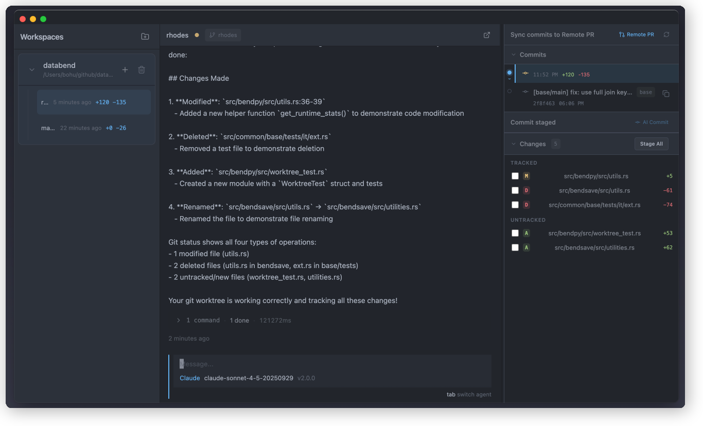
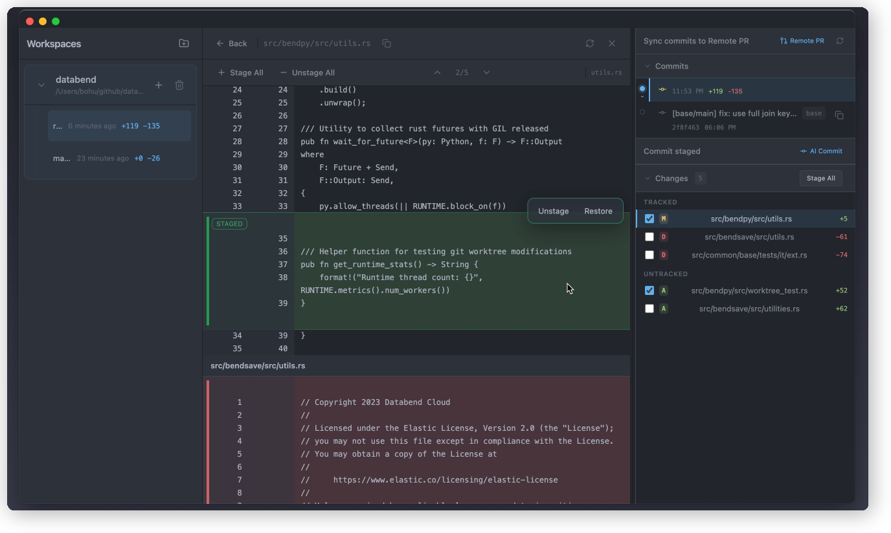

# Snowtree

**AI generates code. You must review. You can't review all or rollback safely.**

Snowtree fixes this: **Worktree isolation + Incremental review + Stage as snapshot**.

<table>
  <tr>
    <td></td>
    <td></td>
  </tr>
</table>

## How It Works

**Isolated Worktrees** — Each AI session in its own worktree. Parallel, no conflicts.

**Native CLI** — Runs Claude Code, Codex directly. No wrapper.

**Incremental Review** — Review each round. Stage approved code. Next round, review diff only.

```
Round 1: AI codes → Review → Stage
Round 2: AI continues → Review diff → Stage
Round N: Done → Commit → Push PR
```

## Prerequisites

Snowtree calls AI coding agents directly via their CLI. Install at least one:

- [Claude Code](https://docs.anthropic.com/en/docs/claude-code) — `npm install -g @anthropic-ai/claude-code`
- [Codex](https://github.com/openai/codex) — `npm install -g @openai/codex`

## Install

Recommended (one-line installer, macOS/Linux):

```bash
curl -fsSL https://raw.githubusercontent.com/bohutang/snowtree/main/install.sh | sh
```

Manual install: https://github.com/bohutang/snowtree/releases

- macOS: `.dmg` (`arm64`, `x64`)
- Linux: `.deb` / `.AppImage` (`x86_64`)
- Windows: not available yet

## Development

```bash
make install
make run
```

Common commands:

- Typecheck/lint/tests: `make check`
- Build packages: `make build`

## License

Apache-2.0
